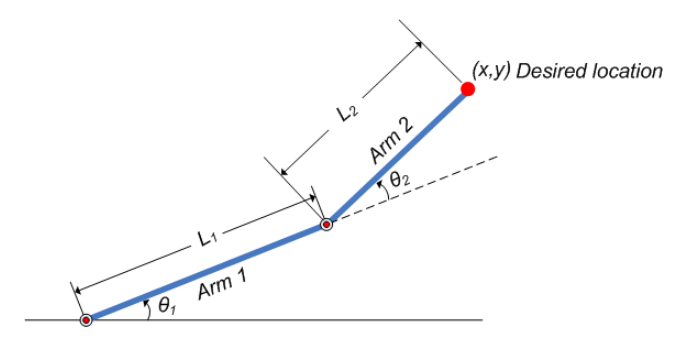
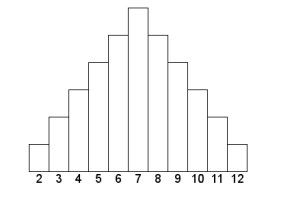

Napisz program symulujący wykonywanie ruchów ramienia robota w przestrzeni 2D. 

Sterowanie ramieniem powinno odbywać się z wykorzystaniem klawiatury bądź elementów (przycisków) interfejsu użytkownika. W aplikacji użytkownik pracuje z ramieniem w dwóch trybach, manualnym oraz automatycznym. Tryb pracy manualnej polega na sterowaniu ramieniem z poziomu interfejsu użytkownika natomiast tryb pracy automatycznej na odtworzeniu zapisanych w pamięci ruchów robota. Operator powinien posiadać możliwość zapisywania ruchów ramienia do pamięci a następnie ich płynnego odtwarzania. W programie powinna istnieć możliwość zdefiniowania prędkości poruszania się ramienia. Robot powinien pracować w przestrzeni ograniczonej. Ramię robota powinna posiadać minimum dwa stopnie swobody. Robot powinien posiadać możliwość podnoszenia i opuszczania elementów. Model fizyczny przestawiono na rysunku poniżej.

1.1
Z wykorzystaniem ramienia robota zbuduj wieżę złożoną z 6 ustawionych na sobie klocków (kształt klocka - kwadrat).

1.2
Z wykorzystaniem ramienia robota zbuduj wieżę złożoną z 6 ustawionych na sobie klocków (kształt klocka - koło).

1.3
Z wykorzystaniem ramienia robota zbuduj wieżę złożoną z 6 ustawionych na sobie klocków (kształt klocka - trójkąt).

1.4
Z wykorzystaniem ramienia robota zbuduj wieżę złożoną z 6 ustawionych na sobie klocków (kształt klocka - prostokąt).

1.5
Zdefiniuj wagę wykorzystywanych w programie bloków. Zadaniem robota jest przeniesienie 3 bloków z jednego miejsca na drugie. Robot posiada ograniczenia co do masy przenoszonego bloku. Jeśli masa została przekroczona – użytkownik powinien otrzymać stosowną informację. W przypadku przekroczenia wartości maksymalnego udźwigu robot pomija blok i przenosi tylko te które jest w stanie.

1.6
Zdefiniuj wagę wykorzystywanych w programie bloków. Zadaniem robota jest przeniesienie 3 bloków z jednego miejsca na drugie. Robot posiada ograniczenia co do masy minimalnej i maksymalnej przenoszonego bloku. Jeśli masa przenoszonego elementu mieści się w stosownym przedziale robot przenosi element z jednego miejsca na drugie. W przypadku przekroczenia wartości in-plus, in-minus użytkownik powinien otrzymać stosowną informację.

1.7
Robot ma dostępny zbiór elementów o różnej wysokości. Na podstawie położenia ramienia sprawdza wysokość elementów i ustawia je w kolejności od najwyższego do najniższego.

1.8
Robot ma dostępny zbiór elementów o różnej wysokości. Na podstawie położenia ramienia sprawdza wysokość elementów i ustawia je w kolejności od najniższego do najwyższego.

1.8
Robot ma dostępny zbiór elementów o różnej wysokości. Na podstawie położenia ramienia sprawdza wysokość elementów i ustawia je w następującej kolejności.

1.9
Robot ma dostępny zbiór 4 elementów o różnej masie. Na podstawie tej informacji ustawia elementy w kolejności od najcięższego do najlżejszego.

1.10
Robot ma dostępny zbiór 4 elementów o różnej masie. Na podstawie tej informacji ustawia elementy w kolejności od najlżejszego do najcięższego.
